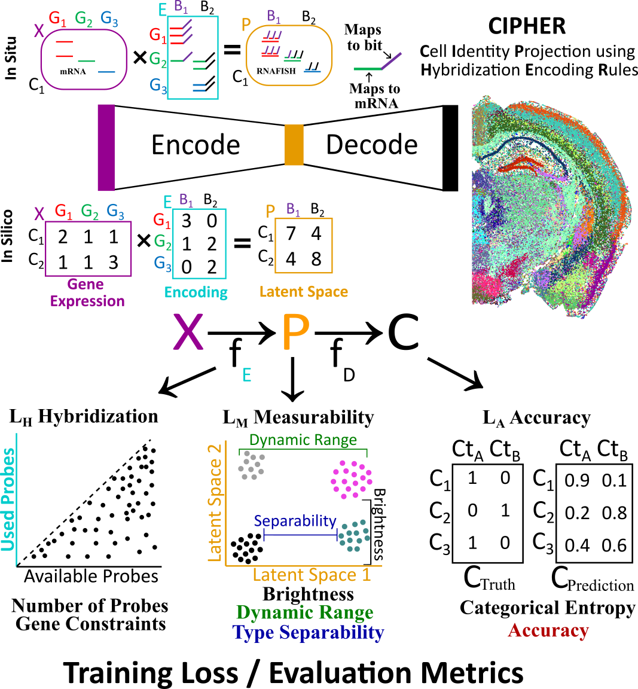

# Design

## Overview

This repository contains **CIPHER** (Cell Identity Projection using Hybridization Encoding Rules), a deep learning framework for designing multiplexed in situ hybridization (ISH) probe sets that can accurately identify cell types from gene expression data.

## What is CIPHER?

**CIPHER** stands for **Cell Identity Projection using Hybridization Encoding Rules**. It is a PyTorch-based neural network system that learns to encode high-dimensional gene expression data into a low-dimensional "bit" representation (projection space) that can be measured using multiplexed ISH probes. The system simultaneously optimizes:

1. **Probe Design**: Determines how many probes to allocate to each gene for each bit
2. **Cell Type Classification**: Learns to decode the bit projections back to cell type identities
3. **Experimental Constraints**: Respects biological and experimental constraints (e.g., maximum probes per gene, target brightness, dynamic range)

### Key Concepts

- **Encoding**: Maps gene expression vectors (n_genes dimensions) to bit projections (n_bit dimensions, typically 3-96 bits)
- **Projection**: The bit values represent the expected signal intensity for each bit in the multiplexed ISH experiment
- **Decoding**: Reconstructs cell type identity from the bit projections

CIPHER enforces three sets of rules through its loss functions:

1. **LA (Accuracy Rules)**: Ensures the ability to decode the correct cell type from the projections
2. **LH (Hybridization Rules)**: Enforces constraints on gene-level probe limits and total number of probes
3. **LM (Measurability Rules)**: Ensures the projections can be accurately measured experimentally:
   - **Brightness**: Signal intensity must reach detectable levels
   - **Dynamic Range**: Sufficient fold-change between low and high expression levels
   - **Separability**: Different cell types must have sufficiently distinct projection patterns

Additionally, CIPHER includes **robustness/training rules** that don't directly affect accuracy, hybridization, or measurability but ensure robust design and prevent overfitting:
- **Training regularization**: Bit usage, bit correlation, sparsity, and gene importance constraints
- **Noise injection**: Various noise terms applied during training to simulate experimental conditions and minimize overfitting

## Architecture




CIPHER consists of two main components:

### 1. Encoder (Projection Layer)

The encoder learns how to allocate probes from each gene to each bit. It uses a PyTorch `Embedding` layer with shape (n_genes × n_bit), where each row represents a gene and each column represents a bit.

**How Encoder Weights Become Probes:**

1. **Raw Weights**: The encoder learns raw weights `W_raw` (n_genes × n_bit) during training. These weights can be any real number.

2. **Activation Function**: An activation function converts raw weights to probe fractions in a valid range:
   - **tanh**: `E_fraction = (tanh(W_raw) + 1) / 2` → maps to [0, 1] range
   - **sigmoid**: `E_fraction = sigmoid(W_raw)` → maps to [0, 1] range
   - **linear**: `E_fraction = W_raw` → uses weights directly (can be negative or >1)
   - **relu**: `E_fraction = relu(W_raw)` → maps to [0, ∞) range

3. **Gene Constraints**: The probe fractions are multiplied by gene constraints to get the final probe allocation:
   ```
   E = E_fraction × constraints
   ```
   where `constraints` is a vector (n_genes) containing the maximum allowed probes per gene. This ensures no gene exceeds its constraint limit.

4. **Final Encoding Weights**: The resulting `E` (n_genes × n_bit) represents the actual number of probes allocated from each gene to each bit. Each value `E[i, j]` is the number of probes from gene `i` allocated to bit `j`.

**Example**: If gene 5 has a constraint of 100 probes and `E_fraction[5, 3] = 0.15` after activation, then `E[5, 3] = 0.15 × 100 = 15` probes from gene 5 are allocated to bit 3.

The encoder is constrained by:
- **Gene-level constraints**: Maximum probes per gene (enforced via multiplication)
- **Total probe budget**: Target total number of probes (enforced via loss function)
- **Activation functions**: Ensure probe fractions are in valid ranges

### 2. Decoder (Classification Network)

The decoder maps bit projections back to cell type predictions. It is a multi-layer neural network with configurable depth.

**Architecture:**

- **Input**: Bit projections `P` (n_samples × n_bit) - the measured signal intensities for each bit

- **Architecture Options**:
  - **`decoder_n_lyr = 0`**: Single linear layer
    - `Linear(n_bit → n_categories)`
    - Direct mapping from bits to cell type logits
  
  - **`decoder_n_lyr > 0`**: Multi-layer network
    - Hidden dimension: `3 × n_bit` (e.g., for 24 bits, hidden dim = 72)
    - Each hidden layer consists of:
      1. `Linear(input_dim → hidden_dim)`
      2. `BatchNorm1d(hidden_dim)` - batch normalization for training stability
      3. Activation function (configurable: relu, leaky_relu, gelu, swish, tanh)
      4. Optional `Dropout(p=D_drp)` if `use_noise=1`
    - Final layer: `Linear(hidden_dim → n_categories)`

**Activation Functions:**
- **relu**: `ReLU(x) = max(0, x)` - most common, allows positive values only
- **leaky_relu**: `LeakyReLU(x) = max(0.01x, x)` - allows small negative values
- **gelu**: `GELU(x) = x × Φ(x)` - smooth activation, often better performance
- **swish**: `Swish(x) = x × sigmoid(x)` - smooth, self-gated activation
- **tanh**: `Tanh(x)` - maps to [-1, 1] range

**Output R:**
The decoder outputs `R` (n_samples × n_categories), which contains **logits** (unnormalized scores) for each cell type:
- Each row corresponds to one sample/cell
- Each column corresponds to one cell type category
- Higher values indicate higher confidence for that cell type
- The predicted cell type is: `y_predict = argmax(R, dim=1)` (the column with the highest logit)

**Example**: If `R[0] = [2.3, 0.1, 5.7, 1.2]` for a cell with 4 possible cell types, the model predicts cell type 2 (index 2, with logit 5.7).

The logits are used with `CrossEntropyLoss` (which applies softmax internally) to compute the classification loss during training.

### Workflow

```
Gene Expression (X) → Encoder (E) → Projection (P) → Decoder → Cell Type Prediction
     (n_genes)         (n_genes×n_bit)   (n_bit)        (n_categories)
```

1. **Projection**: `P = X @ E` (matrix multiplication of gene expression with encoding weights)
2. **Normalization**: Optional sum normalization or bit-wise normalization
3. **Noise Injection**: During training, various noise types are applied to simulate experimental conditions
4. **Decoding**: `R = Decoder(P)` → cell type predictions

## Loss Functions and Optimization Objectives

CIPHER optimizes multiple objectives simultaneously through a weighted loss function. The losses are organized into three main rule categories (LA, LH, LM) plus additional robustness/training rules:

### LA: Accuracy Rules

These losses focus on the ability to decode the correct cell type from the projections:

1. **Categorical Classification Loss** (`categorical_wt`)
   - Cross-entropy loss with label smoothing
   - Ensures accurate cell type identification from projections
   - Primary measure of classification accuracy

### LH: Hybridization Rules

These losses enforce constraints related to probe design and hybridization:

5. **Gene Constraint Loss** (`gene_constraint_wt`)
   - Ensures no gene exceeds its maximum allowed probe count
   - Critical for respecting biological/experimental constraints
   - Enforces per-gene probe limits

6. **Probe Count Loss** (`probe_wt`)
   - **Target**: `n_probes` (total number of probes across all genes)
   - Penalizes when total probe count exceeds the target
   - Uses ELU activation to allow flexibility while encouraging target
   - Once target is reached, loss becomes zero and model can focus on other objectives

### LM: Measurability Rules

These losses ensure that the projections can be accurately measured in experimental conditions:

7. **Brightness Loss** (`brightness_wt`)
   - **Target**: `brightness` (bitwise median signal brightness in log10 scale, e.g., 4.5 = 10^4.5 signal intensity)
   - **Dynamic**: Has `brightness_s` / `brightness_e` for linear interpolation during training
   - Penalizes when median signal brightness is below target
   - Once target is reached, loss becomes zero
   - Prevents signals from being too dim to detect experimentally

8. **Dynamic Range Loss** (`dynamic_wt`)
   - **Target**: `dynamic_fold` (bitwise fold-change between low and high expression levels)
   - **Dynamic**: Has `dynamic_fold_s` / `dynamic_fold_e` for linear interpolation
   - Penalizes when dynamic range is below target
   - Once target is reached, loss becomes zero
   - Ensures bits can distinguish different expression states

9. **Separation Loss** (`separation_wt`)
   - **Target**: `separation_fold` (minimum fold-change between cell type projections)
   - **Dynamic**: Has `separation_fold_s` / `separation_fold_e` for linear interpolation
   - Penalizes when separation between cell types is below target
   - Once target is reached, loss becomes zero
   - Critical for distinguishing cell types

10. **Step Size Loss** (`step_size_wt`)
    - **Target**: `step_size_threshold` (minimum step size between cell types in projection space)
    - Penalizes when step sizes are below target
    - Once target is reached, loss becomes zero
    - Improves separability and ensures measurable differences between cell types

### Robustness and Training Rules

These rules don't directly affect accuracy, hybridization, or measurability but ensure robust design and prevent overfitting:

10. **Bit Usage Loss** (`bit_usage_wt`)
    - **Target**: `bit_usage` (minimum utilization threshold, fraction of expected utilization)
    - Penalizes when bit utilization is below target
    - Once target is reached, loss becomes zero
    - Prevents bit collapse and ensures all bits contribute to classification
    - Promotes robust encoding by preventing unused bits

11. **Bit Correlation Loss** (`bit_corr_wt`)
    - **Target**: `bit_corr` (maximum allowed correlation between bits, 0-1, default 0.8)
    - Penalizes when correlation between any two bits exceeds target
    - Once all bit pairs are below target, loss becomes zero
    - Ensures bits capture independent information
    - Prevents redundant encoding and improves generalization

12. **Sparsity Loss** (`sparsity_wt`)
    - **Target**: `sparsity` (fraction of encoding weights that should be near zero)
    - **Dynamic**: Has `sparsity_s` / `sparsity_e` for linear interpolation
    - Penalizes when sparsity ratio is below target
    - Once target is reached, loss becomes zero
    - Reduces complexity and probe requirements
    - Promotes simpler, more generalizable designs

13. **Gene Importance Loss** (`gene_importance_wt`)
    - **Target**: `gene_importance` (maximum allowed contribution percentage per gene per bit, default 0.25 = 25%)
    - Penalizes when any gene contributes more than the target percentage to any bit
    - Once all genes are below target, loss becomes zero
    - Promotes distributed encoding and reduces dependency on single genes
    - Improves robustness to gene expression variation

### Noise Terms (Regularization, Not Loss Terms)

CIPHER includes extensive noise injection during training to simulate experimental conditions and prevent overfitting. These are not loss terms but regularization mechanisms:

- **Gene-level noise**: `X_drp_s/e` (dropout), `X_noise_s/e` (expression noise)
- **Weight-level noise**: `E_drp_s/e` (encoding weight dropout), `E_noise_s/e` (weight noise)
- **Projection-level noise**: `P_drp_s/e` (projection dropout), `P_noise_s/e` (measurement noise)
- **Constant noise**: `P_add_s/e` (background signal, log10 scale)
- **Decoder dropout**: `D_drp_s/e`

These noise terms force the model to learn robust encodings that work under various experimental conditions, minimizing overfitting to the training data.

### Target-Based Losses and Dynamic Training

Many of CIPHER's loss functions use **target-based optimization**, which provides important benefits for multi-objective training:

**Benefits of Target-Based Losses:**
- Once a target is reached, the loss for that objective becomes zero, allowing the model to focus on objectives that haven't been met yet
- This prevents the model from over-optimizing a few loss terms while ignoring others
- The model naturally balances multiple objectives as it progresses through training

**How Targets Work:**
Most target-based losses only penalize when the current value is **below** (or above) the target. For example:
- If brightness is above the target → loss = 0 (no penalty)
- If brightness is below the target → loss > 0 (penalty proportional to how far below)
- Once brightness reaches the target, the model can focus on other objectives

**Dynamic Targets with _s/_e Parameters:**
Many targets can change linearly during training using `_s` (start) and `_e` (end) parameters:
- `brightness_s` / `brightness_e`: Target brightness at start vs. end of training
- `dynamic_fold_s` / `dynamic_fold_e`: Target dynamic range fold-change
- `separation_fold_s` / `separation_fold_e`: Target separation fold-change
- `sparsity_s` / `sparsity_e`: Target sparsity ratio
- `lr_s` / `lr_e`: Learning rate schedule
- All noise parameters (`X_drp_s/e`, `E_noise_s/e`, etc.)

**Saturation Parameter:**
The `saturation` parameter (0.0-1.0) controls **when** the final (`_e`) values are reached:
- `saturation = 0.5`: All `_s/_e` parameters reach their `_e` values at 50% of training
- `saturation = 1.0`: Parameters reach `_e` values at the end of training (default)
- `saturation = 0.75`: Parameters reach `_e` values at 75% of training

The interpolation formula is: `param = param_s + (param_e - param_s) * progress`, where `progress` is clipped by `saturation`.

**Example:** If `brightness_s = 3.0`, `brightness_e = 4.5`, and `saturation = 0.5`:
- At iteration 0: target brightness = 3.0
- At 25% of training: target brightness = 3.75
- At 50% of training: target brightness = 4.5 (reached early due to saturation)
- At 50-100% of training: target brightness = 4.5 (stays constant)

This allows the model to start with easier targets and gradually increase difficulty, or to reach final targets early and maintain them throughout the rest of training.

**Loss Terms with Targets:**

1. **Probe Count Loss** - Target: `n_probes` (total number of probes)
2. **Brightness Loss** - Target: `brightness` (log10 scale, has `_s/_e`)
3. **Dynamic Range Loss** - Target: `dynamic_fold` (fold-change, has `_s/_e`)
4. **Separation Loss** - Target: `separation_fold` (fold-change, has `_s/_e`)
5. **Sparsity Loss** - Target: `sparsity` (fraction of zeros, has `_s/_e`)
6. **Gene Importance Loss** - Target: `gene_importance` (max 25% contribution per gene per bit)
7. **Bit Usage Loss** - Target: `bit_usage` (minimum utilization threshold)
8. **Bit Correlation Loss** - Target: `bit_corr` (maximum allowed correlation, 0-1)
9. **Step Size Loss** - Target: `step_size_threshold` (minimum step size between cell types)

**Loss Terms Without Targets:**
- **Categorical Classification Loss**: Continuous optimization (no target, always active)
- **Gene Constraint Loss**: Hard constraint violation (penalty only when violated)

## Key Parameters

This section provides a quick reference for key parameters. For detailed explanations of loss functions, targets, and dynamic parameters, see the "Loss Functions and Optimization Objectives" section above.

### Core Model Parameters

- `n_cpu`: Number of CPU threads (typically 3-12). Note: CPU-only execution
- `n_bit`: Number of bits in encoding (typically 3-96)
- `n_iters`: Total training iterations (typically 10,000-100,000+)
- `batch_size`: Batch size (0 = use full dataset)
- `n_probes`: Target total number of probes (e.g., 50,000, 500,000)
- `decoder_n_lyr`: Number of decoder hidden layers (0-3+)

### Loss Function Weights

All loss weights control the relative importance of each objective:
- `categorical_wt`, `probe_wt`, `gene_constraint_wt`, `brightness_wt`, `dynamic_wt`, `separation_wt`
- `sparsity_wt`, `gene_importance_wt`, `bit_usage_wt`, `bit_corr_wt`, `step_size_wt`

See "Loss Functions and Optimization Objectives" for details on each loss.

### Training Control

- `lr_s` / `lr_e`: Learning rate schedule (see "Target-Based Losses" for _s/_e explanation)
- `saturation`: When _s/_e parameters reach final values (0.0-1.0, see detailed explanation above)
- `gradient_clip`: Maximum gradient norm for clipping
- `report_rt`: Training progress reporting frequency (iterations)

### Target Parameters (with _s/_e support)

These parameters support dynamic targets that change during training:
- `brightness_s/e`: Target brightness (log10 scale)
- `dynamic_fold_s/e`: Target dynamic range fold-change
- `separation_fold_s/e`: Target separation fold-change
- `sparsity_s/e`: Target sparsity ratio
- All noise parameters: `X_drp_s/e`, `X_noise_s/e`, `E_drp_s/e`, `E_noise_s/e`, `P_drp_s/e`, `P_noise_s/e`, `P_add_s/e`, `D_drp_s/e`

### Target Parameters (static)

- `n_probes`: Target total probe count
- `gene_importance`: Max gene contribution per bit (default 0.25)
- `bit_usage`: Minimum bit utilization threshold
- `bit_corr`: Max allowed bit correlation (default 0.8)
- `step_size_threshold`: Minimum step size between cell types

### Data and File Paths

- `X_train` / `X_test`: Training/test feature tensors (.pt files)
- `y_train` / `y_test`: Training/test label tensors (.pt files)
- `constraints`: Gene constraints CSV file
- `y_label_converter_path`: Label mapping CSV
- `top_n_genes`: Number of top genes to keep (0 = all)

### Model Configuration

- `device`: Computation device ('cpu' - default)
- `encoder_act`: Encoder activation ('tanh', 'sigmoid', 'linear', 'relu')
- `decoder_act`: Decoder activation ('relu', 'leaky_relu', 'gelu', 'swish', 'tanh')
- `sum_norm`: Sum normalization (0 or 1)
- `bit_norm`: Bit-wise normalization (0 or 1)
- `use_noise`: Enable noise during training (0 or 1)
- `continue_training`: Continue if model loaded (0 or 1)
- `best_model`: Save best model checkpoint (0 or 1)

## Repository Structure

```
.                                   # Repository root
├── Design/                          # Main code directory
│   ├── CIPHER.py                   # Main CIPHER training script
│   ├── CIPHER_diagram.png          # Architecture diagram
│   ├── run_cipher_simple.ipynb     # Simple notebook for running CIPHER
│   ├── create_parameter_file.py    # Parameter file generation (general)
│   ├── create_parameter_file_lymph.py    # Parameter file generation (lymph)
│   ├── create_parameter_file_dev_mouse.py # Parameter file generation (dev mouse)
│   ├── Data_Format/                # Data processing scripts
│   │   ├── data_format.py          # Allen WMB data formatting
│   │   ├── data_format_lymph.py   # Lymph node data formatting
│   │   ├── data_format_dev_mouse.py # Developmental mouse data formatting
│   │   ├── create_type_tree.py    # Cell type tree generation
│   │   └── README.md              # Data formatting documentation
│   ├── Submission_Scripts/         # HPC job submission scripts
│   │   ├── sub_multi_param_file_optimization.sh
│   │   ├── sub_multi_param_file_optimization_failed_tasks.sh
│   │   ├── submit_run_directory.sh
│   │   ├── submit_all_single_jobs_in_run.sh
│   │   ├── submit_single_job.sh
│   │   ├── submit_simulation.sh
│   │   ├── sub_python_script.sh
│   │   ├── sub_data_format.sh
│   │   ├── resubmit_failed_tasks.sh
│   │   └── README.md               # Submission scripts documentation
│   ├── Results/                     # Result analysis and visualization
│   │   ├── simulation.py           # Simulation analysis
│   │   ├── get_results.py          # Result aggregation
│   │   ├── create_figures.py       # Figure generation
│   │   └── README.md               # Results analysis documentation
│   └── Sequences/                   # Probe sequence assembly
│       ├── make_fasta.ipynb        # Main probe assembly notebook
│       ├── super_probe_30mer_arms_2025Apr24.ipynb  # 30-mer readout arm generation
│       ├── super_probe_20mer_arms_2025Apr30.ipynb  # 20-mer readout arm generation
│       ├── optimized_sequences_30mers.csv          # Optimized 30-mer sequences
│       ├── optimized_sequences_20mers.csv          # Optimized 20-mer sequences
│       ├── mm10_probes_Oct28_2022.csv              # Mouse probe database
│       └── README.md               # Sequence assembly documentation
├── LICENSE                          # MIT License
├── README.md                        # This file
├── requirements.txt                 # Python dependencies
└── setup.py                         # Package setup script
```

## High-Level Workflow and Architecture

The CIPHER repository is organized into modular components that work together in a complete pipeline from raw data to experimental probe sequences:

```
┌─────────────────────────────────────────────────────────────────┐
│                    CIPHER Workflow Pipeline                     │
└─────────────────────────────────────────────────────────────────┘

1. Data Preparation
   └─► [Design/Data_Format/](Design/Data_Format/README.md)
       • Process scRNA-seq data (h5ad files)
       • Generate training/test tensors (X_train.pt, y_train.pt, etc.)
       • Create categorical_converter.csv and constraints.csv
       • Scripts: data_format.py, data_format_lymph.py, data_format_dev_mouse.py

2. Parameter Configuration
   └─► [Design/create_parameter_file.py](Design/create_parameter_file.py)
       • Generate parameter files for single or batch runs
       • Dataset-specific variants available

3. CIPHER Training
   └─► [Design/CIPHER.py](Design/CIPHER.py)
       • Train encoder and decoder networks
       • Optimize probe allocation and classification
       • Output: encoding weights (E_weights.csv), model checkpoints, results

4. Job Submission (HPC)
   └─► [Design/Submission_Scripts/](Design/Submission_Scripts/README.md)
       • Submit single jobs or batch parameter sweeps
       • Manage array jobs and failed task resubmission
       • Scripts: sub_multi_param_file_optimization.sh, submit_single_job.sh, etc.

5. Result Analysis
   └─► [Design/Results/](Design/Results/README.md)
       • Run simulation analysis (simulation.py)
       • Aggregate results across runs (get_results.py)
       • Generate publication figures (create_figures.py)

6. Probe Sequence Assembly
   └─► [Design/Sequences/](Design/Sequences/README.md)
       • Convert encoding weights to probe sequences
       • Generate optimized readout arms
       • Assemble complete probes with primers and restriction sites
       • Notebooks: make_fasta.ipynb, super_probe_*mer_arms_*.ipynb
```

### Component Overview

- **[Data_Format/](Design/Data_Format/README.md)**: Data processing and formatting scripts that convert raw scRNA-seq data into CIPHER-compatible formats. Handles multiple dataset types (Allen Brain Atlas, lymph node, developmental mouse).

- **[Submission_Scripts/](Design/Submission_Scripts/README.md)**: HPC cluster job submission scripts for running CIPHER on compute clusters. Supports single jobs, array jobs, batch processing, and failed task management.

- **[Results/](Design/Results/README.md)**: Analysis and visualization tools for evaluating CIPHER designs. Includes simulation testing, result aggregation, and figure generation.

- **[Sequences/](Design/Sequences/README.md)**: Probe sequence assembly pipeline that converts abstract encoding weights into complete DNA probe sequences ready for experimental synthesis.

### Quick Navigation

- **Getting Started**: See [Quick Start: Simple Notebook](#quick-start-simple-notebook-recommended-for-first-time-users) for the easiest way to run CIPHER
- **Data Formatting**: See [Data_Format/README.md](Design/Data_Format/README.md) for dataset-specific formatting instructions
- **HPC Usage**: See [Submission_Scripts/README.md](Design/Submission_Scripts/README.md) for cluster job submission workflows
- **Result Analysis**: See [Results/README.md](Design/Results/README.md) for simulation and visualization tools
- **Probe Assembly**: See [Sequences/README.md](Design/Sequences/README.md) for converting designs to sequences

## Installation

### Option 1: Using pip (Recommended)

The easiest way to install CIPHER and its dependencies:

```bash
pip install -r requirements.txt
```

Or install as a package:

```bash
pip install -e .
```

### Option 2: Using Conda Environment

To set up the necessary environment with Conda:

1. **Create the Conda environment:**
    ```bash
    conda create -n "designer_3.12" python=3.12
    ```

2. **Activate the Conda environment:**
    ```bash
    conda activate designer_3.12
    ```

3. **Install required packages:**
    ```bash
   pip install -r requirements.txt
   ```

### Dependencies

CIPHER requires:
- Python >= 3.8
- PyTorch >= 2.0.0
- pandas >= 1.5.0
- numpy >= 1.21.0
- matplotlib >= 3.5.0
- seaborn >= 0.12.0
- scikit-learn >= 1.0.0
- anndata >= 0.8.0 (for h5ad file support)
- ipykernel >= 6.0.0 (for Jupyter notebook support)

## Usage

### Quick Start: Simple Notebook (Recommended for First-Time Users)

For a simple, self-contained workflow that doesn't require shell scripts, use the provided Jupyter notebook:

**`Design/run_cipher_simple.ipynb`** - A complete notebook that includes:
1. Data formatting (loads h5ad files and formats them for CIPHER)
2. Parameter setup (configurable parameters with sensible defaults)
3. Running CIPHER (initialization, training, and evaluation)

**To use the notebook:**
1. Open the notebook on your compute node (with conda environment activated)
2. Update the paths in Step 2 to point to your data files
3. Run all cells sequentially

The notebook handles all data formatting, parameter file creation, and CIPHER execution in one place, making it ideal for interactive use or when you don't want to use shell scripts.

### Running Single Jobs (Command Line)

Follow these steps to execute CIPHER on a single parameter configuration:

1. **Format Data:**
   - Use one of the data formatting scripts in `Design/Data_Format/`:
     - `data_format.py` - For Allen Whole Mouse Brain dataset
     - `data_format_lymph.py` - For mouse lymph node datasets
     - `data_format_dev_mouse.py` - For developmental mouse datasets
   - These scripts prepare your gene expression data into the required format:
     - `X_train.pt`, `X_test.pt`: Training and test gene expression tensors
     - `y_train.pt`, `y_test.pt`: Training and test cell type label tensors
     - `categorical_converter.csv`: Mapping from cell type names to integer labels (required for CIPHER)
     - `constraints.csv`: Maximum allowed probes per gene
   - See `Design/Data_Format/README.md` for detailed information on each script

2. **Create Parameter File:**
   - Use `Design/create_parameter_file.py` to create parameter files, or manually create a CSV file following the format described below
   - For dataset-specific parameter file creation, see:
     - `create_parameter_file_lymph.py` - For lymph node datasets
     - `create_parameter_file_dev_mouse.py` - For developmental mouse datasets

3. **Run CIPHER:**
   - Execute the main script using the following command, replacing `"path/to/parameters/file"` with the actual path to your parameters CSV file:
    ```bash
    python Design/CIPHER.py "path/to/parameters/file"
    ```

   The script will:
   - Load parameters from the CSV file
   - Initialize the encoder and decoder
   - Train the model for the specified number of iterations
   - Save model checkpoints, evaluation results, and visualizations
   - Generate comprehensive performance reports

### Running Multiple Jobs (Parameter Sweeps)

For systematic exploration of parameter space, use the batch processing workflow:

1. **Format Reference Scripts:**
   - Use scripts in `Design/Data_Format/`:
     - `data_format.py` - Formats the data for the reference dataset
     - `data_format_lymph.py` - For lymph node datasets
     - `data_format_dev_mouse.py` - For developmental mouse datasets
     - `create_type_tree.py` - Creates the type tree for the reference (if needed)
   - **Parameters to change:** `data_path`, `output_path`, `csv_file` (in each script)
   - ```bash
      conda activate designer_3.12
      python Design/Data_Format/data_format.py
      ```

2. **Create Parameter Files and Submit Jobs:**
   - `Design/create_parameter_file.py` - Creates parameter files for all combinations and automatically submits jobs
     - **Parameters to change:** `base_dir`, `parameter_variant_list` (in the script)
     - ```bash
        conda activate designer_3.12
        python Design/create_parameter_file.py [Run#]
        ```
     - **Run number:** You can specify a run number (e.g., `Run0`, `Run1`) or let the script automatically find the next available run number
     - This script:
       - Generates all parameter combinations from `parameter_variant_list`
       - Creates CSV parameter files in `Runs/Run#/params_files_to_scan/`
       - Automatically calls `sub_multi_param_file_optimization.sh` to submit jobs
   
   - `Design/Submission_Scripts/sub_multi_param_file_optimization.sh` - Submits and manages batch jobs
     - **Parameters to change:** `OPT_DIR`, `CODE_DIR`, replace `Run0` with your run number
     - **Note:** This script is automatically called by `create_parameter_file.py`, but can be run manually:
     - ```bash
        ./Design/Submission_Scripts/sub_multi_param_file_optimization.sh Run0
        ```
   - See `Design/Submission_Scripts/README.md` for detailed information on all submission scripts

### Parameter File Format

Parameter files are CSV files with two columns:
- Column 1: Parameter name (index)
- Column 2: Parameter value

Example:
```csv
values
n_cpu,3
n_bit,24
n_iters,100000
batch_size,500
...
```

### Input Data Format

CIPHER expects the following input files:

1. **Gene Expression Data:**
   - `X_train.pt`: PyTorch tensor of shape (n_train_samples, n_genes) - training gene expression
   - `X_test.pt`: PyTorch tensor of shape (n_test_samples, n_genes) - test gene expression

2. **Cell Type Labels:**
   - `y_train.pt`: PyTorch tensor of shape (n_train_samples,) - training cell type labels (integer indices)
   - `y_test.pt`: PyTorch tensor of shape (n_test_samples,) - test cell type labels (integer indices)

3. **Gene Constraints:**
   - `constraints.csv`: CSV file with maximum allowed probes per gene
   - Format: One column with constraint values (one per gene, in same order as genes in X)

4. **Label Mapping:**
   - `categorical_converter.csv`: CSV file mapping integer labels to cell type names
   - Format: Two columns - integer index and cell type name

### Output Files

CIPHER generates comprehensive output in the specified output directory:

1. **Model Files:**
   - `model_best.pt`: Best model checkpoint (if `best_model=1`)
   - `model_final.pt`: Final model checkpoint
   - `optimizer_state.pt`: Optimizer state

2. **Training Statistics:**
   - `learning_stats.csv`: Detailed training statistics for each iteration
   - `training_log.txt`: Comprehensive training log

3. **Evaluation Results:**
   - `evaluation_results.csv`: Final evaluation metrics
   - `P_test_averages.csv`: Average projections per cell type (no noise)
   - `confusion_matrix.csv`: Cell type classification confusion matrix

4. **Visualizations:**
   - `comprehensive_performance.pdf`: Training curves and performance metrics
   - `projection_heatmap.pdf`: Heatmap of projections by cell type
   - `confusion_matrix.pdf`: Visual confusion matrix

5. **Encoding Weights:**
   - `E_weights.csv`: Final encoding weights (probe fractions per gene per bit)
   - `E_weights.pt`: PyTorch tensor of encoding weights

## Understanding the Results

### Encoding Weights (E)
The encoding weights represent the learned probe design:
- Each row corresponds to a gene
- Each column corresponds to a bit
- Values represent the fraction of probes allocated to that gene for that bit
- Values are constrained by gene constraints and activation functions

### Projections (P)
The projections represent the expected signal for each bit:
- Each row is a cell/sample
- Each column is a bit
- Values represent expected signal intensity (can be normalized)

### Performance Metrics
- **Accuracy**: Cell type classification accuracy
- **Separation**: Minimum fold-change between cell type projections
- **Dynamic Range**: Fold-change between low and high expression levels
- **Brightness**: Median signal intensity
- **Probe Count**: Total number of probes used

## Additional Workflows

### Result Analysis

After running CIPHER designs, use scripts in `Design/Results/` to analyze and visualize results:

- **`simulation.py`**: Test probe designs on simulated experimental data
- **`get_results.py`**: Aggregate results from multiple design runs
- **`create_figures.py`**: Generate publication-quality figures

See `Design/Results/README.md` for detailed documentation.

### Probe Sequence Assembly

After training CIPHER, convert encoding weights to complete probe sequences using notebooks in `Design/Sequences/`:

- **`make_fasta.ipynb`**: Main assembly notebook that converts encoding weights to probe sequences
- **`super_probe_30mer_arms_2025Apr24.ipynb`**: Generate optimized 30-mer readout arms (currently used)
- **`super_probe_20mer_arms_2025Apr30.ipynb`**: Generate optimized 20-mer sequences (for future bDNA applications)

See `Design/Sequences/README.md` for detailed documentation.

## Tips and Best Practices

1. **Start with fewer bits**: Begin with 12-24 bits to understand the system before scaling up
2. **Monitor training**: Check `learning_stats.csv` and logs regularly
3. **Adjust loss weights**: If one objective isn't being met, increase its weight
4. **Use noise during training**: Set `use_noise=1` to improve robustness
5. **Respect constraints**: Ensure `gene_constraint_wt` is high enough to prevent violations
6. **Check convergence**: Look for plateau in loss and accuracy metrics
7. **Save best model**: Set `best_model=1` to automatically save the best checkpoint
8. **Use appropriate data formatting script**: Choose the correct `data_format*.py` script for your dataset type
9. **Check submission script documentation**: See `Design/Submission_Scripts/README.md` for HPC cluster usage

## Troubleshooting

- **Training diverges**: Reduce learning rate, increase gradient clipping, or reduce loss weights
- **Constraints violated**: Increase `gene_constraint_wt` or check constraint file format
- **Low accuracy**: Increase `categorical_wt`, check data quality, or increase model capacity
- **Out of memory**: Reduce batch size, number of genes, or reduce `n_cpu` threads
- **Noise too high**: Reduce noise parameters or set `use_noise=0` for debugging

## License

This project is licensed under the MIT License - see the [LICENSE](LICENSE) file for details.

## Citation

If you use CIPHER in your research, please cite:

```
Hemminger, Z. (2024). CIPHER: Cell Identity Projection using Hybridization Encoding Rules. 
[Add publication details when available]
```

## Contact

For questions, issues, or contributions, please contact:
- **Zachary Hemminger**: zehemminger@gmail.com
